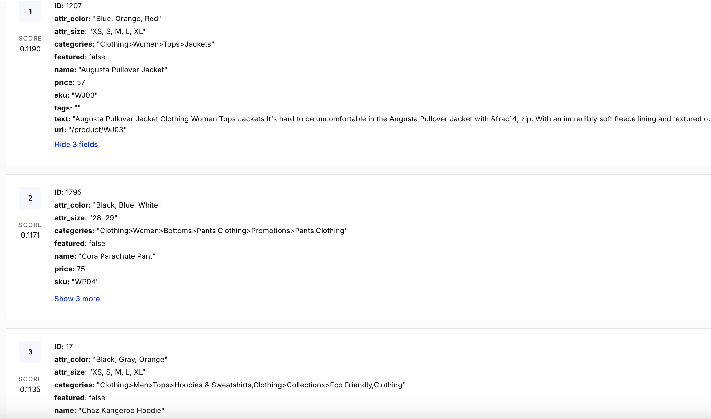

# AI Product Finder

A demonstration WordPress Gutenberg block showcasing AI-powered e-commerce product search using vector embeddings and LLM integration.


## Overview

AI Product Finder enables customers to search using natural language descriptions instead of traditional keyword matching. The plugin demonstrates modern AI/ML integration patterns in WordPress using vector similarity search and large language models.

## How it Works

### Product Catalog Setup

This demo uses a sample WooCommerce catalog of around 150 products found at https://github.com/iconicwp/woocommerce-sample-data which originally draws from [Magento's sample data set](https://github.com/magento/magento2-sample-data). 

### Semantic Search and Vector Databases

**Traditional keyword search** looks for exact word matches. If you search for "cozy winter clothes" it only finds products with those exact words in the title or description.

**Semantic search** understands meaning and context. It knows that "cozy" relates to "warm," "comfortable," and "soft," and that "winter clothes" includes hoodies, sweaters, and jackets - even if those exact words aren't in the product name.

**Vector databases** make this possible by converting text into mathematical representations called embeddings. Each product description becomes a list of numbers that capture its semantic meaning. Similar products have similar number patterns, allowing the database to find related items based on meaning rather than just keywords.

**Pinecone** is a cloud-based vector database where we can upload our product catalog and get instant semantic search capabilities. Each product's name, description, and attributes are processed through an embedding model and converted into a n-dimensional vector that captures its semantic meaning, then stored in Pinecone for fast similarity search.

**Setup Process:** A Python script was used to read the WooCommerce CSV file. Each product was processed through Pinecone's `llama-text-embed-v2` embedding model to generate 1024-dimensional vectors. The vectors are then uploaded to Pinecone along with product data (name, description, price, categories, attributes etc.). The index `woocommerce-products` is configured for cosine similarity search to find semantically related products.



### The AI-powered Search Process

When a customer searches for "cozy hoodie for winter":

**Step 1: Generate Query Embedding**
```php
$pinecone->generate_embedding("cozy hoodie for winter");
// API Call: Pinecone text embedding API with the query string
// Returns: 1024-dimensional vector representing the search intent
```

**Step 2: Vector Similarity Search**
```php
$pinecone->search($embedding, 3);
// API Call: Pinecone vector database with the embedding from previous step
// Returns: Top 3 products with highest similarity scores
```

**Step 3: Generate Explanations**
```php
$openai->explain_matches($query, $products);
// API Call: GPT-4o mini with structured prompt 
// Input: User query + product details for the matched products
// Returns: JSON with explanations for each product match
```

## Technical Highlights

* **Dynamic Gutenberg Block** - Server-side PHP rendering with JavaScript enhancement.

* **Block Attributes & Controls** - Editable block title using RichText component.

* **WordPress REST API Integration**
   - Custom namespace endpoint `POST /wp-json/ai-product-finder/v1/search`.
   - Structured JSON responses with search results and AI explanations.
   - Input validation and WP_Error handling.

* **WooCommerce Integration**
   - Map results from the index to WooCommerce product using SKU. 
   - Enrich the results from index with the up-to-date WooCommerce data such as pricing, images and URL.
   - Product results link to the product URL.

* **Service Class Architecture** - Dedicated `Pinecone_Service` and `OpenAI_Service` classes to seperate external API operations from the core logic.

## Installation & Configuration

Refer [readme.txt](./readme.txt)

## Future Improvements

This is a demo plugin and could be improved with:

**Feature Improvements**
- Ability to customize or remove the suggestions in order to support different catalogs.
- Better progress indicators during the slow API calls.
- Admin settings page for API key management.
- Responsive design for different block contexts like sidebar, widget areas etc.
- Ability to control the number of products to be displayed.

**Technical Improvements**
- Error logging.  
- Search results caching.
- Internationalization support.
- Improve security of REST endpoint by rate-limiting, nonce verification, etc.

## License

This code is licensed under GPL v2 or later license. See [LICENSE](./LICENSE).
